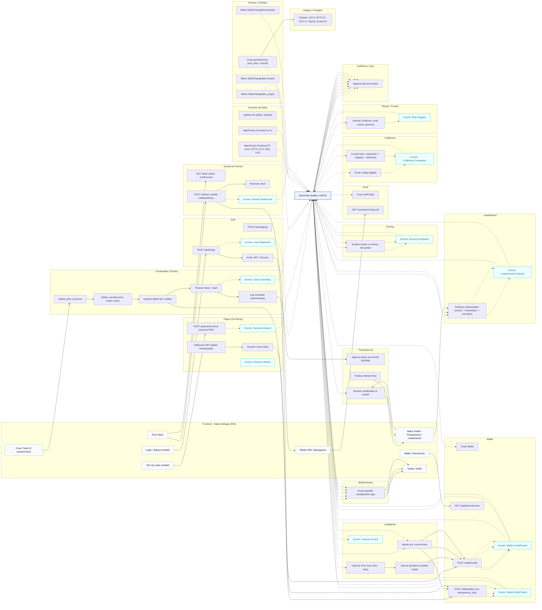

# Habla! — Juego de combinadas de fútbol con “Lukas”

Este repositorio es la **fuente de verdad** del front web y del backend lógico de Habla!, una webapp donde los jugadores compran Lukas (moneda in-app) para entrar a torneos de predicciones de fútbol. El pozo se forma con las entradas y se liquida a los primeros puestos; las Lukas pueden canjearse en la tienda de premios.
La app es navegable como visitante (sin registro), pero participar en torneos, hacer top-ups y canjear premios requiere iniciar sesión.

## Mecánica del juego (resumen)

- Cada torneo corresponde a un solo partido y pasa por estados: open → en_juego → terminado (o cancelado).
- Cada ticket es una combinada de 5 predicciones:
1. Local/Empate/Visita (3 pts)
2. Ambos anotan (2 pts)
3. Más de 2.5 goles (2 pts)
4. Habrá tarjeta roja (6 pts)
5. Marcador exacto (8 pts)
- Un jugador puede enviar múltiples combinadas no idénticas para el mismo partido.
- Al kickoff se revelan todas las combinadas (transparencia).
- Al finalizar, se califican tickets, se publica Leaderboard y se abonan premios en la Wallet.
- En el perfil se muestra el historial de 30 días (tickets, puntos, posiciones y movimientos de wallet).

## Front-end

- HTML único (SPA con enrutamiento por hash) + TailwindCSS.
- Vistas clave: Matches, Match Detail (Transparencia/Leaderboard), Create Ticket, Wallet/Movements, Prize Store, How to Play, FAQ.
- Sin conexión a backend (mock in-memory), preparado para reemplazar llamadas por APIs reales.
- Visitantes pueden navegar todo; acciones sensibles (crear ticket, top-up, canjear) piden login.
- Formulario de Registro (UI); Campos visibles y obligatorios:
  -  Correo electrónico
  -  Contraseña
  -  Nombres
  -  Apellidos
  -  Nickname /Nombre visible
  -  Fecha de Nacimiento
  -  País de Residencia
  -  Aceptaciones (checkboxes): Términos y Condiciones, Política de Privacidad, Política de Juego Responsable, Declaración "Soy mayor de 18 años"

## Diagrama (Mermaid) — Microservicios y flujos
>**Nota**: Este diagrama refleja solamente los microservicios definidos para Habla! y sus conexiones.

## Descripción de Flujos  del Usuario en el app
>**Nota**: En esta sección se describe las acciones que el jugador va a realizar dentro del app como parte de su experiencia de juego.

1) **Registro de Cuenta**

   *Objetivo*: crear la cuenta y el perfil mínimo para permitir compras de Lukas y participación en torneos, dejando pendiente la verificación de correo y de mayoría de edad para el momento del canje.

   - Campos de registro (obligatorios): Correo electrónico, constraseña, Nombres, Apellidos, Nickname / Nombre visible, Fecha de Nacimiento, País de Residencia (código ISO-2), Aceptaciones (Términos y Condiciones, Política de Privacidad, Política de Juego Responsable, Declaración de ser mayor de 18 años
   

## Microservicios (responsabilidades, interfaces y eventos)

Formato por servicio: Responsabilidades · Endpoints (ejemplos) · Publica · Suscribe · Datos

1. **Auth**
- Resp.: identidad, sesiones (JWT), alta/login.
- Endpoints: POST /auth/signup, POST /auth/login.
- Publica: User.Registered.
- Suscribe: —
- Datos: usuarios (id, email, estado verificación).

2. **Perfil**
- Resp.: perfil básico, alias, avatar; historial agregado 30 días.
- Endpoints: GET /me/history?days=30.
- Publica: —
- Suscribe: User.Registered (para crear perfil).
- Datos: perfil y vistas materializadas de historial.

3. **Wallet**
- Resp.: saldo de Lukas, asientos contables, idempotencia.
- Endpoints: POST /wallet/credit, POST /wallet/debit, GET /wallet/movements.
- Publica: Wallet.CreditPosted, Wallet.DebitPosted.
- Suscribe: pagos liquidados, liquidación de premios, ajustes.
- Datos: ledger (append-only) y saldos.

4. **Pagos (On-Ramp)**
- Resp.: checkout con PSP, conciliación, conversión a Lukas.
- Endpoints: POST /payments, POST /webhooks/psp.
- Publica: Payment.Initiated, Payment.Settled.
- Suscribe: —
- Datos: órdenes de pago, estados PSP, trazas.

5. **Torneos & Partidos**
- Resp.: alta de partido/torneo; estados open/en_juego/terminado/cancelado; lock_time.
- Endpoints: (backoffice) POST /tournaments, PATCH /match/state.
- Publica: Match.StateChanged(en_juego|terminado|cancelado).
- Suscribe: —
- Datos: partidos/torneos y metadatos.

6. **Reglas & Puntajes**
- Resp.: catálogo versionado de reglas (puntajes fijos).
- Endpoints: GET /rulesets/:id.
- Publica: —
- Suscribe: —
- Datos: ruleset_id referenciado por torneos.

7. **Combinadas (Tickets)**
- Resp.: validar picks, unicidad por (user, match, hash), registrar tickets.
- Endpoints: POST /tickets.
- Publica: Ticket.Submitted.
- Suscribe: Match.StateChanged(en_juego) (lock de venta).
- Datos: tickets con hash/merkletree ref.

8. **Oráculos de Datos**
- Resp.: hechos oficiales (goles, BTTS, O2.5, roja, FT).
- Endpoints: webhooks/ingesta proveedor.
- Publica: MatchFacts.Finalized, MatchFacts.Corrected(v+1).
- Suscribe: —
- Datos: snapshot por partido (versionado).

9. **Transparencia**
- Resp.: WORM/append-only; Reveal al kickoff; Merkle root.
- Endpoints: GET /transparency/:matchId.
- Publica: —
- Suscribe: Ticket.Submitted, Match.StateChanged(en_juego).
- Datos: set de tickets por partido + pruebas de no-mutación.

10. **Scoring**
- Resp.: evaluar cada ticket vs hechos; sumar puntos; desglose.
- Endpoints: (interno) POST /score/:matchId.
- Publica: Scoring.Completed.
- Suscribe: Match.StateChanged(terminado), MatchFacts.Finalized|Corrected.
- Datos: resultados por ticket.

11. **Leaderboard**
- Resp.: ranking por torneo; desempates (exacto → timestamp → prorrateo).
- Endpoints: GET /leaderboard/:matchId.
- Publica: Leaderboard.Finalized.
- Suscribe: Scoring.Completed.
- Datos: snapshot inmutable por versión.

12. **Liquidación**
- Resp.: cálculo de pozo (Σ fees − rake); abono a ganadores; ajustes por correcciones/cancelaciones.
- Endpoints: (interno) POST /settle/:matchId.
- Publica: Payouts.Posted.
- Suscribe: Leaderboard.Finalized, Match.StateChanged(cancelado).
- Datos: órdenes de pago de premio y ajustes.

13. **Tienda de Premios**
- Resp.: catálogo, reglas, canje de Lukas y reserva de stock.
- Endpoints: GET /store, POST /redeem.
- Publica: Reward.Redeemed.
- Suscribe: —
- Datos: productos, stock y órdenes de canje.

14. **Fulfillment**
- Resp.: entrega digital (códigos) o física (courier).
- Endpoints: (interno) POST /fulfill/:orderId.
- Publica: Fulfillment.Completed.
- Suscribe: Reward.Redeemed.
- Datos: estados de entrega.

15. **Riesgo / Fraude**
- Resp.: velocity/IP/device, multi-cuenta, spikes, patrones.
- Endpoints: (interno) POST /risk/check.
- Publica: Risk.Flagged.
- Suscribe: Ticket.Submitted, Reward.Redeemed, Payment.Settled.
- Datos: señales y decisiones.

16. **Notificaciones**
- Resp.: plantillas y envío a email/push/in-app.
- Endpoints: POST /notify.
- Publica: —
- Suscribe: eventos clave (pagos, tickets, leaderboard, payouts, fulfillment).
- Datos: colas de notificación y logs de entrega.

17. **Auditoría & Logs**
- Resp.: append-only de todos los eventos para trazabilidad.
- Endpoints: (interno) POST /audit/append.
- Publica: —
- Suscribe: todos los eventos del bus.
- Datos: almacén WORM.

## Catálogo de eventos canónicos (resumen)

- **Usuarios/Wallet/Pagos**: User.Registered, Wallet.CreditPosted, Wallet.DebitPosted, Payment.Initiated, Payment.Settled.
- **Torneos/Partidos**: Match.StateChanged(en_juego|terminado|cancelado), Ticket.Submitted.
- **Datos/Resolución**: MatchFacts.Finalized, MatchFacts.Corrected, Scoring.Completed, Leaderboard.Finalized, Payouts.Posted.
- **Tienda/Entrega**: Reward.Redeemed, Fulfillment.Completed.
- **Riesgo**: Risk.Flagged.
> **Event Bus (Kafka o NATS)**: backbone de mensajería asíncrona para publicar/suscribir eventos, escalar consumidores y lograr consistencia eventual con bajo acoplamiento.

## Licencia
© Habla! 2025. Todos los derechos reservados.
